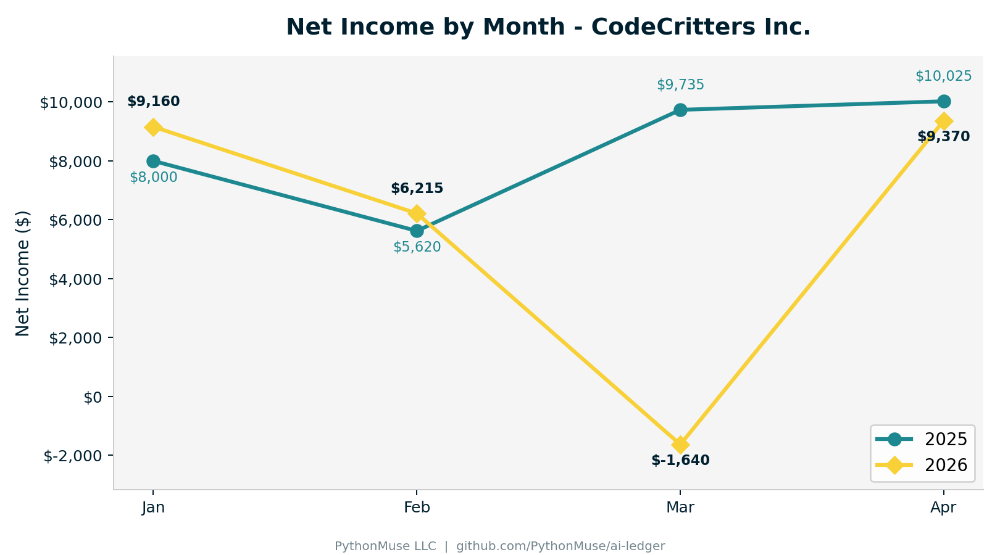
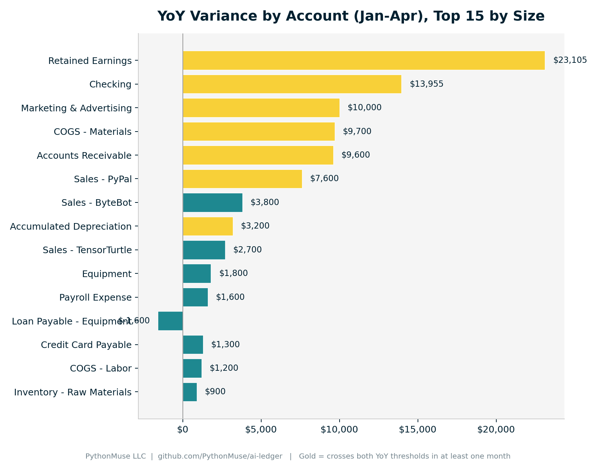
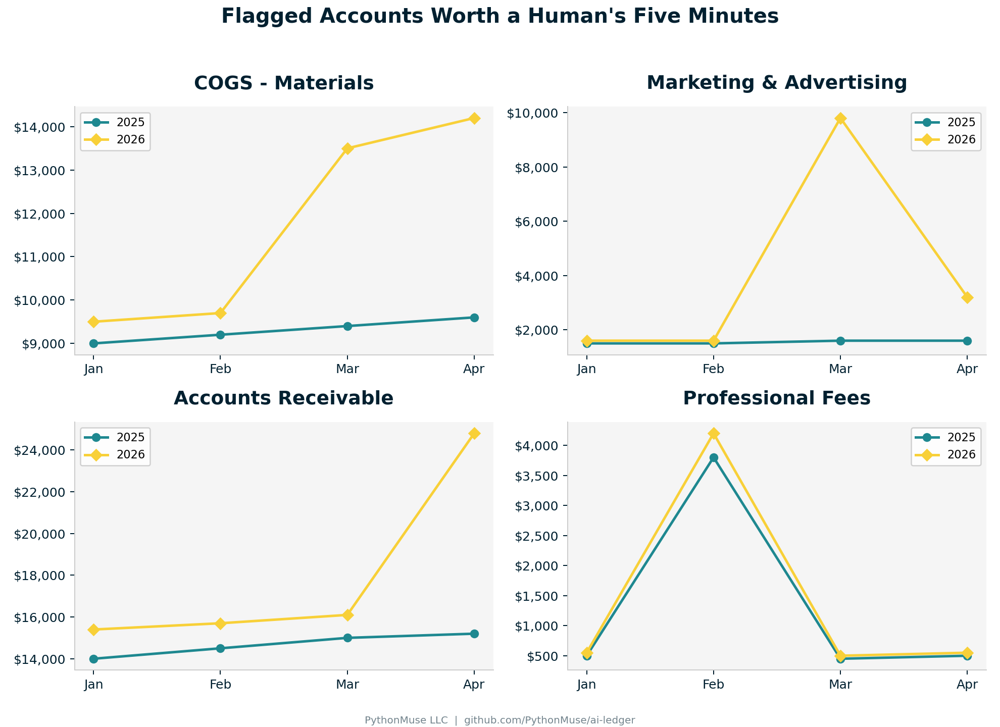

# PythonMuse Trial Balance Comparison Demo

> **About PythonMuse:** an open-source project building practical, governed patterns for using AI in accounting, audit, and finance workflows. Real controls. Real source files. Real evidence trails. No magic-wand demos.
>
> **This repo** is one of those patterns — Varia, a variance-analysis co-pilot that compares two trial balance periods, flags what's actually worth a human's attention, and shows its work.

This repo builds an agent-run Year-over-Year and Month-over-Month trial
balance comparison for a fictional company, **CodeCritters Inc.** — two
QuickBooks-style trial balances, Jan–Apr 2025 (prior year) and Jan–Apr 2026
(current year) — and asks Varia to do what a reviewing accountant does: find
what moved, decide what's worth asking about, and show it, not just say it.

**What we're working with:**
- `data/trial_balance_2025.csv` — prior year, Jan–Apr, by account
- `data/trial_balance_2026.csv` — current year, Jan–Apr, by account
- 31 accounts: Assets, Liabilities, Equity, Revenue, COGS, Expense
- Both files actually balance (Assets = Liabilities + Equity) every month — because a trial balance that doesn't balance isn't one

See `CLAUDE.md` for Varia's full character definition and rules, and
`agents/varia_variance_agent.md` for the step-by-step execution sequence.

---

## The First Trap: You Can't Just Sum a Balance Sheet Account

Ask an AI to "total the YoY variance by account" without specifying anything, and it will happily add Checking's four monthly balances together. That number means nothing — you don't sum four snapshots of a bank balance and call it a variance.

| Account Category | What the monthly column means | How to compare YoY/MoM |
|---|---|---|
| Balance Sheet (Assets, Liabilities, Equity) | Ending balance *at that point in time* | Compare the same point in time (e.g., Apr ending balance vs. Apr ending balance) |
| P&L (Revenue, COGS, Expense) | Activity *during that month* | Sum across the period, or compare month-to-month directly |

This distinction is the whole reason the comparison script treats the two account families differently instead of running one blanket formula over every row.

```python
FLOW_TYPES = {"Revenue", "COGS", "Expense"}

if account_type in FLOW_TYPES:
    prior_val, curr_val = prior_df[months].sum(), curr_df[months].sum()
else:
    prior_val, curr_val = prior_df["Apr"], curr_df["Apr"]  # ending balance, not a sum
```

**Translation:** if it's a balance sheet account, grab the balance. If it's a P&L account, add up the activity. Mixing those up is how a "$23,000 swing in Retained Earnings" chart quietly turns into a chart of nothing.

---

## The Comparison Logic

Two variance passes run over the data:

1. **Year-over-Year** — same month, current year vs. prior year (Jan '26 vs Jan '25, Feb '26 vs Feb '25, etc.)
2. **Month-over-Month** — sequential months within the current year only (Jan → Feb → Mar → Apr, 2026)

Each variance gets flagged only if it clears **both** a dollar and a percentage bar — a lone $50 swing that happens to be 300% of a near-zero account shouldn't light up the report, and a 6% swing on a six-figure account shouldn't either.

| Comparison | $ Threshold | % Threshold |
|---|---|---|
| Year-over-Year | > $2,500 | > 15% |
| Month-over-Month | > $2,500 | > 20% |

```python
flagged = abs(dollar_var) > DOLLAR_THRESHOLD and abs(pct_var) > PCT_THRESHOLD
```

This mirrors the standard "either exceeded" materiality pattern controllers already use for budget-vs-actual — just pointed at prior-period and prior-year instead of budget.

---

## What It Found

Running both passes on CodeCritters' Jan–Apr data surfaced **17 YoY flags** and **7 MoM flags**. A few are worth a human's five minutes:

- **COGS – Materials**: up sharply in March and April 2026 vs. 2025 — consistent with a vendor cost inflation story. Not new, but now it's dated and quantified.
- **Marketing & Advertising**: a one-month spike in March 2026 (~6x the prior months) that isn't in the prior year at all — a real campaign, or a miscoded invoice?
- **Office Supplies**: a one-time March spike large enough to trip both thresholds — worth checking whether an equipment purchase got miscoded to an expense account instead of capitalized.
- **Accounts Receivable**: balloons in April 2026 specifically — the kind of pattern that's invisible in a single month's TB but obvious the moment you diff two periods.
- **Professional Fees**: spikes every February, both years — flagged by the MoM pass, *not* flagged YoY. That's the model correctly recognizing "this happens every year at audit time" isn't a surprise.

That last one matters as much as the flags themselves: **the goal isn't to flag everything, it's to flag what's actually unusual.** Depreciation Expense, Rent, Insurance, and Utilities never cross either threshold in this dataset — they're the control group proving the model isn't just circling every non-zero number.





---

## The Rule of Thumb

1. **Decide the comparison basis before writing a single formula.** Point-in-time balances get compared point-in-time; period activity gets summed or compared period-to-period. Never both the same way.
2. **Require two conditions to flag, not one.** Dollar-only buries small accounts in noise; percent-only drowns you in "50% increase on $40."
3. **Let recurring seasonal items prove themselves.** A February spike that shows up in both years isn't a finding — it's a pattern.
4. **Ship a reconciling trial balance, always.** If Assets ≠ Liabilities + Equity in your sample data, nothing downstream is trustworthy — check that first, before any variance logic.

---

## Repo structure

```
pythonmuse-YOY-variance-analysis/
├── README.md
├── CLAUDE.md                          # Varia's character, rules, hook, and canary
├── requirements.txt
│
├── .claude/
│   ├── settings.json                  # PreToolUse hook wiring
│   └── hooks/
│       └── protect_source_data.py     # blocks edits + blocks raw ledger dumps into chat
│
├── agents/
│   └── varia_variance_agent.md        # step-by-step execution instructions
│
├── skills/
│   └── trial-balance-comparison/
│       ├── SKILL.md                   # comparison logic, inputs/outputs, steps
│       └── scripts/
│           └── generate_visuals.py    # the comparison + charts + Excel report
│
├── scripts/
│   └── build_sample_data.py           # regenerates the two source CSVs (not part of the analysis)
│
├── data/
│   ├── trial_balance_2025.csv         # prior year, Jan-Apr, read-only source
│   └── trial_balance_2026.csv         # current year, Jan-Apr, read-only source
│
└── outputs/
    ├── visuals/
    │   ├── 01_net_income_trend.png
    │   ├── 02_yoy_variance_by_account.png
    │   └── 03_flagged_accounts_trend.png
    └── excel/
        └── CodeCritters_TB_Comparison_Report.xlsx
```

---

## Running the demo

```bash
pip install -r requirements.txt
python3 skills/trial-balance-comparison/scripts/generate_visuals.py
```

Everything downstream of the two CSVs regenerates from scratch — thresholds
included, at the top of the script. To rebuild the sample source data itself
from scratch, run `python3 scripts/build_sample_data.py`.

---

## AI Usage Notice

This demo's sample data is synthetic and built to illustrate specific variance patterns — it does not represent a real company or real financials. Validate any thresholds or logic against your own organization's materiality standards before reusing this pattern on real data.
